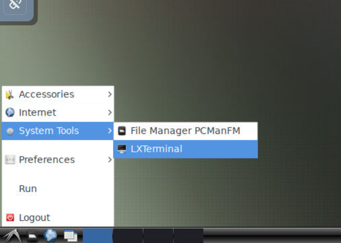

# Setting Up Your Docker for AquaGS
Before you can build mate plans ,you need to install Docker.    
There are 3 main sections to this guide:


## 1.Pull the specified image for AquaGS
Run the following command in the Shell (Windows) or Terminal (Linux) of the device on which the Docker is installed.
```
docker pull liangbeam/aquags
```
## 2.Create a container
Run the following command
```
docker run -d --name aquags-vnc -p 5901:22 -p 6080:80 -p 5900:5900 -e VNC_PASSWORD=1234  liangbeam/aquags
```
Commands  | Explanation|
------------- | -------------
-p 5901:22  | SSH port
-p 6080:80  | NOVNC port (for web)
-p 5900:5900 | VNC port 
-e VNC_PASSWORD=1234|VNC and NOVNC password


The `5901`,`6080`,`5900` is the ports mapped to the host.You can change the port number before the ``:`` to suit your needs.

## 3.Access the container 
There are three ways to access the container
> ### a. SSH
> 
> ```
> ssh -p 5901 root@<ip>
> ```
> >Replace  `<ip>`  with the ip for the device on which the Docker is installed.    

> ### B. Web NOVNC
> Enter the following in the browser.
> 
> ```
> <ip>:6080
> ```
> or run 
> ```
> http://<ip>:6080
> ```
> 
> >Replace  `<ip>`  with the ip for the device on which the Docker is installed. 
>     
> Enter the password, then you can access the desktop for container in browser.   
> Open LXTerminal.
> 

> ### C. VNC
> 
> Connect `<ip>:5900` in VNC Viewer.And open LXTerminal.(The same to B)
> >Replace  `<ip>`  with the ip for the device on which the Docker is 

## 4.Run AquaGS_GUI
AquaGS_GUI download to the desktop (directory is `/root/Desktop/AquaGS_GUI_release/`).

**You need to run it in that directory** by run the command on the Terminal(or LXTerminal).
```
cd /root/Desktop/AquaGS_GUI_release/
./AquaGS_GUI
```

The demo data is provided under this folder `/root/Desktop/input/`   

**Do not contain Spaces (' ') in the output path**


