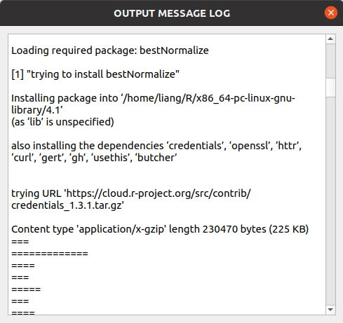

# Install packages for R
### Automatic installation
- As user friendly tool,the Function of " install all  package for R in one click " has been integrated in AquaGS_GUI.A stable network connection  is still essential for Automatic installation.

- You'll see such like this in the window named "Information output log"  when you first use AquaGS GUI and haven't installed the extension pack for R in advance.This is  installing the required  packages automatically.

- when the error occurs during automatic installation,you will see this. Then you have to install packages manually.

---
## Manual installation
- Manual installation also works.You can install these packages manually if you want.

	 - The Requirement List show here:

		| **package** |**version** |
		|---|---|
		|  data.table | |
		| bestNormalize | |
		| ggplot2| |
		| sommer | |
		| lme4 | |
		| lmerTest | |
		| nadiv | |
		| ASRgenomics | |
		|BGLR|

---
### Notice 
Some solutions to the errors during installation are summarize [here](./errors_in_installing.md).