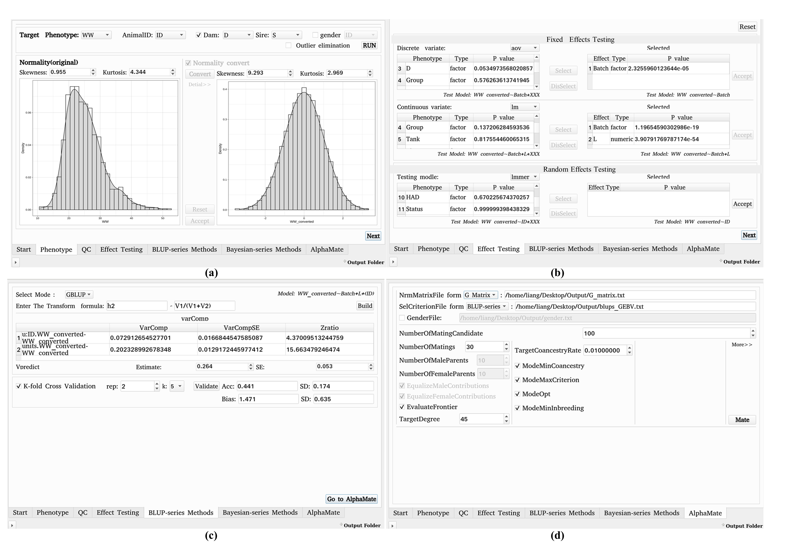

# AquaGS
## What is AquaGS?
AquaGS is an open source tool for Aquaculture breeding programs with friendly graphical user interfaces(GUI).

AquaGS offers click-by-click running from inputting variant call file (.vcf) to the final mate allocation scheme. No need to prepare anything just except variant call file and phenotype file(.csv).

Everything Genomic Selection(GS) workflow needs are contained by AquaGS, such as preprocessing,effect testing,breeding-value calculating and mate allocating.Users no longer need to switch between software on different platforms. At the sametime, we  provide **[detailed tutorial](#jumpInstall)** to install (), try to put a lot of power into your hands by making easy things easy, and hard things possible. 


# How to start?
**Update docker support** 2022/12/15   
## <span id="jumpInstall">1. Install AquaGS
- ## Install by **docker**(Windows/Linux/Mac)   
    **Make sure the [Docker](https://www.docker.com/)  is installed, Follow these steps (using windows as an example)**

 
  1. ### Run the specified image for AquaGS

       - Run the following command to pull the specified image for AquaGS in the Shell (Windows) or Terminal (Linux) of the device on which the Docker is installed.
        ```
        docker pull liangbeam/aquags
        ```
      
        - Run the following command to create a container

        ```
        docker run -d --name aquags-vnc -p 5901:22 -p 6080:80 -p 5900:5900 -e VNC_PASSWORD=1234  liangbeam/aquags
        ```
      Commands  | Explanation|
      ------------- | -------------
      --name aquags-vnc|container name
      -p 5901:22  | SSH port
      -p 6080:80  | NOVNC port (for web)
      -p 5900:5900 | VNC port 
      -e VNC_PASSWORD=1234|VNC and NOVNC password
  2. ### Enter the container by Web
    Enter the following in the browser.
        ```
        <ip>:6080
        ```
        or run in cmd
        ```
        http://<<ip>:6080
- ## Install by **conda**(Linux)
### b. Install by docker


1. If you know how to use Docker,a image of all environments and AquaGS is provided [here](https://hub.docker.com/r/liangbeam/aquags). It is based on [dorowu/ubuntu-desktop-lxde-vnc](https://hub.docker.com/r/dorowu/ubuntu-desktop-lxde-vnc/#!) and has built-in SSH, VNC, NOVNC. You can use AquaGS via SSH, VNC Viewer, or even browser.    
 Following [the install tutorial for docker user](./Md/Setting_Up_by_Docer.md).


**Guide for tranditional install** 
1. Installation step-by-step 
   
   Download the zip of AquaGS to local from [releases page](https://github.com/LiangBeam9810/AquaGS_GUI/releases).

   Following [the install tutorial(Setting Up Your Environment)](./Md/Setting_Up_Your_Environment.md), AquaGS can be easily installed by anyone even without programming experience.

---
   
2. <span id="RunningInstructions"> Runing </span>
   
    Make sure  [the install tutorial](./Md/Setting_Up_Your_Environment.md)or [the install tutorial for docker user](./Md/Setting_Up_by_Docer.md) is completed before you run AquaGS.Then you will start using AquaGS normally.

    1. Launched AquaGS
    
        AquaGS can be launched  the "AquaGS_GUI",which in the decompressed folder (like running `cd ./AquaGS_GUI_releases` and  `./AquaGS_GUI`).
    
    2. Select/Enter input and output **(Do not contain Spaces (' ') in path)**
   
        In this page,you should select the path of phenotype file(.csv) , variant call file(.vcf / .tar) and output folder.  
        We provided the test data in [here](https://github.com/LiangBeam9810/AquaGS_GUI/releases)
        

    3. Phenotype Preprocessing

        All Preprocessing of phentype will be completed in this page.Here contain 

    4. Genotype Preprocessing(Quality Control)
    5. Effects testing
    6. Calculation of breeding values
    7. Mating

## Functions detail
1. Preprocessing
   1. Phenotype Preprocessing
        1.  [Outlier Elimination](./Md/Outlier_elimination.md)
        2. [Normality Testing and Converting](./Md/Normality.md)

   2. Genotype Preprocessing(Quality Control)
        1. [Genotype imputation](./Md/imputation.md)
        1. [HW Balance](./Md/HWBalance.md)
        2. [Plink](./Md/PLink.md)
   1. Matirx Building
      1. [A Matirx](./Md/A.md)
      2. [G Matirx](./Md/G.md)
      3. [H Matrix](./Md/H.md)

2. Effect Testing
     1. Fixed Effect
         1. [Discrete Effect]()
         2. [Continuous Effect]()
     2. [Random Effect]()

  
3. Genotype Seletion(GS) / Calculating [GEBV]()
   1. Classical Method
      1. [BLUP]()
      2. [GBLUP]()
      3. [ssGBLUP]()
   2. Bayes Method
   
4.[Mate Allocation]()


---
# Feedback
If you have any doubt, you can ask us for Email.

You can also open an [issue on GitHub](https://github.com/LiangBeam9810/AquaGS_GUI/issues). This is especially handy when your issue will require long-term discussion or debugging.


