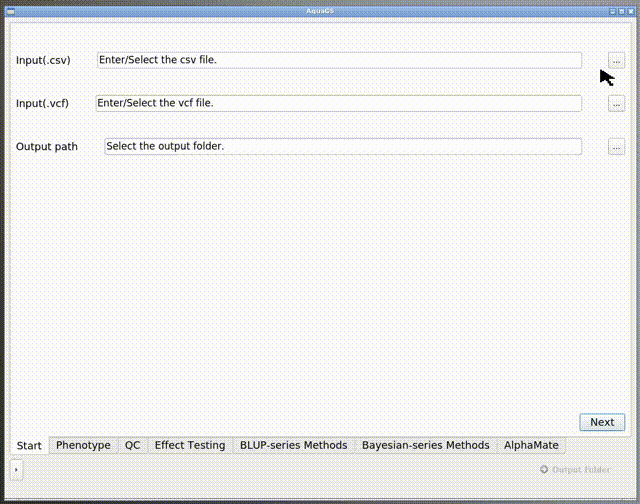

# AquaGS
## What is AquaGS?
AquaGS is an open source tool for Aquaculture breeding programs with friendly graphical user interfaces(GUI).

AquaGS offers click-by-click running from inputting variant call file (.vcf) to the final mate allocation scheme. No need to prepare anything just except variant call file and phenotype file(.csv).

Everything Genomic Selection(GS) workflow needs are contained by AquaGS, such as preprocessing,effect testing,breeding-value calculating and mate allocating.Users no longer need to switch between software on different platforms. At the sametime, we  provide **[detailed tutorial](#jumpInstall)** to install (), try to put a lot of power into your hands by making easy things easy, and hard things possible. 


# <span id="jumpInstall"> How to start?
**Update docker support** 2022/12/15   
- ## Run AquaGS by **docker** (Windows/Linux/Mac):+1:
     :exclamation: **Make sure the [Docker](https://www.docker.com/)  is installed, Follow these steps (using windows as an example)**

  ### 1. Pull the specified image for AquaGS

    - Run the following command to pull the specified image for AquaGS in the Shell (Windows) or Terminal (Linux) of the device on which the Docker is installed.
        ```
        docker pull liangbeam/aquags
        ```
         
    - Run the following command to create a container
        ```
        docker run -d --name aquags-vnc -p 5901:22 -p 6080:80 -p 5900:5900 -e VNC_PASSWORD=1234  liangbeam/aquags
        ```
         
      Commands  | Explanation|
      ------------- | -------------
      --name aquags-vnc|container name
      -p 5901:22  | SSH port
      -p 6080:80  | NOVNC port (for web)
      -p 5900:5900 | VNC port 
      -e VNC_PASSWORD=1234|VNC and NOVNC password
  ### 2.  Enter the container by Web
        
    - Enter the following in the browser. 
        ```
        <ip>:6080
        ```
        > Replace  `<ip>`  with the ip for the device on which the Docker is installed.    

        Enter the password, then you can access the desktop for container in browser.
     
   ### 3.   Launch AquaGS
    - AquaGS_GUI download to the desktop  (directory is `/root/Desktop/AquaGS_GUI_release/`).
    **You need to run it in that directory** by run the command on the Terminal(or **LXTerminal**).
        ```
        cd /root/Desktop/AquaGS_GUI_release/
        ./AquaGS_GUI
        ```
         
    **Do not contain Spaces (' ') in the output path**      

Then enjoy AquaGS.:smiley:

- ## Install by **tranditional** (Linux)
    **Guide for tranditional install** 
  1. Download the zip of AquaGS to local from [releases page](https://github.com/LiangBeam9810/AquaGS_GUI/releases).
  2. Following [the tranditional install tutorial(Setting Up Your Environment)](./AquaGS/Md/Setting_Up_Your_Environment.md), AquaGS can be easily installed by anyone even without programming experience.

---
   
- ##  <span id="RunningInstructions"> Runing AquaGS</span>
   
    Make sure  [the install tutorial](./AquaGS/Md/Setting_Up_Your_Environment.md)or [the install tutorial for docker user](./AquaGS/Md/Setting_Up_by_Docer.md) is completed before you run AquaGS.Then you will start using AquaGS normally.

    1. Launch AquaGS
    
        AquaGS can be launched  the "AquaGS_GUI",which in the decompressed folder (like running `cd ./AquaGS_GUI_releases` and  `./AquaGS_GUI`).
         
    
    2. Select/Enter input and output **(Do not contain Spaces (' ') in path)**
   
        - In this page,you should select the path of **phenotype file(.csv)** , **variant call file(.vcf / .tar)** and output folder.  
          - We provided the test data in [here](https://github.com/LiangBeam9810/AquaGS_GUI/releases). (If you are using Docker, the input file is in the Input folder on the desktop `/root/Desktop/input/` )
        

    3. Phenotype Preprocessing
        - Select type of phenotypes (Factor / Numeric).
            
        - All Preprocessing of phentype will be completed in this page
          - `Dam` `Sire` `gender` is optional phenotype . If you need to use parent-specific method (e.g. ABLUP), you must provide `Dam` and `Sire` in **phenotype file(.csv)** . If the breeding program requires gender differentiation, you must provide `gender` in **phenotype file(.csv)** .
        
          - Normality convert
            
    4. Genotype Preprocessing(Quality Control)
        - AquaGS implements quality control for genotype data by PLINK [1], where GENO and MIND are optional to filter out SNP with low call rate and individuals with low sample genotype call rate. 
        - The Hardy-Weinberg(HW) balance module is optional to test Hardy-Weinberg Equilibrium.
        - Genotype imputation is base on BEAGLE [2].
         
    5. Effects testing
        - the effects testing in terms of permutations and combinations between multiple variables should be implemented following the steps of testing：
          - Discrete fixed effects
            
          - Continuous fixed effects
            
          - Random effects
            
         Under the combination of user-selected fixed and random effects by simple-click operations, p-values are calculated for each variable to evaluate the reasonability of current linear model. 
    6. Calculation of breeding values
       
       - K-fold Cross Validation
        

    7. Mating
        The breeding scheme of mating allocation based on OCS is produced by AlphaMate[3].
        
- ## Functions detail
    1. Preprocessing
    2. Phenotype Preprocessing
        1.  [Outlier Elimination](./AquaGS/Md/Outlier_elimination.md)
        2. [Normality Testing and Converting](./AquaGS/Md/Normality.md)

    3. Genotype Preprocessing(Quality Control)
        1. [Genotype imputation](./AquaGS/Md/imputation.md)
        2. [HW Balance](./AquaGS/Md/HWBalance.md)
        3. [Plink](./AquaGS/Md/PLink.md)
    4. Matirx Building
      1. [A Matirx](./AquaGS/Md/A.md)
      2. [G Matirx](./AquaGS/Md/G.md)
      3. [H Matrix](./AquaGS/Md/H.md)

    5. Effect Testing
        1. Fixed Effect
            1. [Discrete Effect]()
            2. [Continuous Effect]()
        2. [Random Effect]()

  
    6. Genotype Seletion(GS) / Calculating [GEBV]()
        1. Classical Method
            1. [BLUP]()
            2. [GBLUP]()
            3.  [ssGBLUP]()
        1. Bayes Method
   
    7. [Mate Allocation]()


---
# Feedback
If you have any doubt, you can ask us for Email.

You can also open an [issue on GitHub](https://github.com/LiangBeam9810/AquaGS_GUI/issues). This is especially handy when your issue will require long-term discussion or debugging.

---
# Citaion

[1] https://zzz.bwh.harvard.edu/plink/
[2] https://faculty.washington.edu/browning/beagle/beagle.html
[3] https://alphagenes.roslin.ed.ac.uk/wp/software-2/alphamate/


