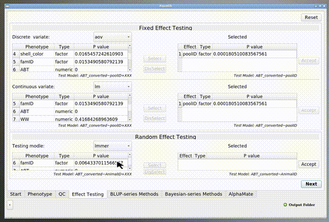

# AquaGS

## What is AquaGS?

AquaGS is an open source tool for Aquaculture breeding programs with friendly graphical user interfaces(GUI).

AquaGS offers click-by-click running from inputting variant call file (.vcf) to the final mate allocation scheme. No need to prepare anything just except variant call file and phenotype file(.csv).

Everything Genomic Selection(GS) workflow needs are contained by AquaGS, such as preprocessing,effect testing,breeding-value calculating and mate allocating.Users no longer need to switch between software on different platforms. At the sametime, we  provide **[detailed tutorial](#jumpInstall)** to install, try to put a lot of power into your hands by making easy things easy, and hard things possible.

## How to start?

### Install AquaGS

There are two ways to do this:

#### 1. 👍Docker-based installation (Windows/Linux/Mac support)

- This Docker-based installation ,which requires no environment configuration and is highly recommended if you are trying AquaGS for the first time.
- [This guide](./AquaGS/Md/Docker-based-installation.md) provides a gif of each step of the process for reference.

#### 2. Traditional installation (Linux)

Traditional installation require you to pre-prepare your *R* and *Java* runtime environment follow [the tranditional install tutorial(Setting Up Your Environment)](./AquaGS/Md/Setting_Up_Your_Environment.md)

---

### Runing AquaGS

  Make sure [the tutorial for Docker-based installation](./AquaGS/Md/Docker-based-installation.md) or [the tranditional install tutorial](./AquaGS/Md/Setting_Up_Your_Environment.md) is completed before you run AquaGS. Then you will start using AquaGS normally.

1. Launch AquaGS

   AquaGS can be launched  the "AquaGS_GUI",which in the decompressed folder (like running `cd ./AquaGS_GUI_releases` and  `./AquaGS_GUI`).
   
2. Select/Enter input and output **(Do not contain Spaces (' ') in path)**

   - In this page,you should select the path of **phenotype file(.csv)** , **variant call file(.vcf / .tar)** and output folder.
     - We provided the test data in [here](https://github.com/Ying-Lab/AquaGS/releases/download/data/testdata.rar). (If you are using Docker, the input file is in the Input folder on the desktop `/root/Desktop/input/` )
       
3. Phenotype Preprocessing

   - Select type of phenotypes (Factor / Numeric).
     
   - All Preprocessing of phentype will be completed in this page
     - `Dam` `Sire` `gender` is optional phenotype . If you need to use parent-specific method (e.g. ABLUP), you must provide `Dam` and `Sire` in **phenotype file(.csv)** . If the breeding program requires gender differentiation, you must provide `gender` in **phenotype file(.csv)** .
       
     - Normality convert
       
4. Genotype Preprocessing(Quality Control)

   - AquaGS implements quality control for genotype data by PLINK [1], where GENO and MIND are optional to filter out SNP with low call rate and individuals with low sample genotype call rate.
   - The Hardy-Weinberg(HW) balance module is optional to test Hardy-Weinberg Equilibrium.
   - Genotype imputation is base on BEAGLE [2].
     
5. Effects testing

   - the effects testing in terms of permutations and combinations between multiple variables should be implemented following the steps of testing：
     - Discrete fixed effects
       
     - Continuous fixed effects
       
     - Random effects
       
       Under the combination of user-selected fixed and random effects by simple-click operations, p-values are calculated for each variable to evaluate the reasonability of current linear model.
6. Calculation of breeding values
   

   - K-fold Cross Validation
     
7. Mating
   The breeding scheme of mating allocation based on OCS is produced by AlphaMate[3].
   

- ## Functions detail

  1. Preprocessing
  2. Phenotype Preprocessing

     1. [Outlier Elimination](./AquaGS/Md/Outlier_elimination.md)
     2. [Normality Testing and Converting](./AquaGS/Md/Normality.md)
  3. Genotype Preprocessing(Quality Control)

     1. [Genotype imputation](https://faculty.washington.edu/browning/beagle/beagle.html)
     2. [Plink](https://www.cog-genomics.org/plink/)
  4. [Mate Allocation](https://github.com/AlphaGenes/AlphaMate)

---

# Feedback

If you have any doubt, you can ask us for Email.

You can also open an [issue on GitHub](https://github.com/LiangBeam9810/AquaGS_GUI/issues). This is especially handy when your issue will require long-term discussion or debugging.

---

# Citaion

[1] https://zzz.bwh.harvard.edu/plink/
[2] https://faculty.washington.edu/browning/beagle/beagle.html
[3] https://alphagenes.roslin.ed.ac.uk/wp/software-2/alphamate/
